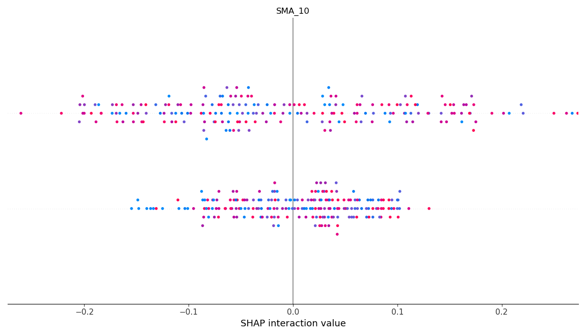

<p align="center">
  
</p>

<h1 align="center">💹 ML Trading Signal Engine</h1>
<p align="center">
  Random Forest | FastAPI | Streamlit | SHAP | YAML Config
</p>

---

## 📈 Overview

This project is a full-stack AI trading signal engine that generates real-time BUY/SELL decisions using technical indicators like SMA, RSI, and Returns.

It includes:
- ✅ Machine learning with Random Forest
- ✅ Modular config via YAML
- ✅ SHAP feature explainability
- ✅ Streamlit dashboard for traders
- ✅ FastAPI backend for developers

---

## 📂 Project Structure
ml_trading_signal/
├── api/ # FastAPI REST backend
│ └── main.py
├── dashboard/ # Streamlit dashboard
│ └── app.py
├── config/ # Strategy config
│ └── strategy_config.yml
├── data/ # Simulated price & signal data
│ └── market_data.csv
├── models/ # Trained ML model
│ └── rf_model.pkl
├── visuals/ # SHAP or dashboard plots
│ └── shap_summary.png
└── README.md


## ⚙️ Technologies Used

- `scikit-learn` – Random Forest model  
- `pandas` – Data handling  
- `joblib` – Model persistence  
- `yaml` – Dynamic strategy config  
- `SHAP` – Feature importance  
- `Streamlit` – Dashboard UI  
- `FastAPI` – RESTful API backend

  ## 🚀 How to Run

### 1️⃣ Streamlit Dashboard
```bash
cd ml_trading_signal
streamlit run dashboard/app.py

Key Highlights
Built fully from scratch using simulated data

SHAP plots integrated for model interpretability

Clean modular folder structure for production use

Ready for real-time trade simulation or web deployment

👨‍💻 Author
Shiva Sai
Pre-WashU Quant Prep
